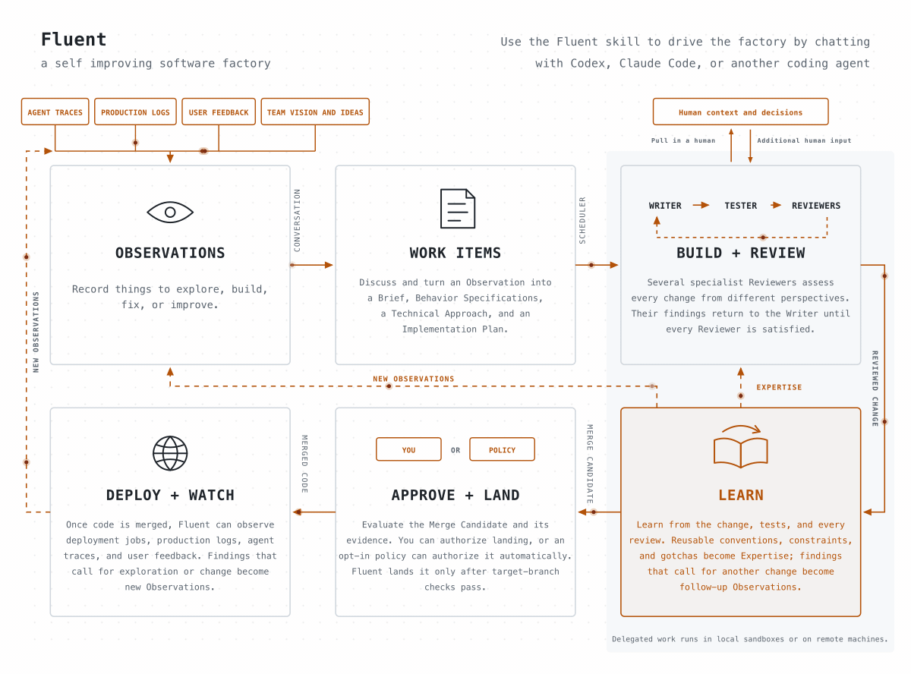
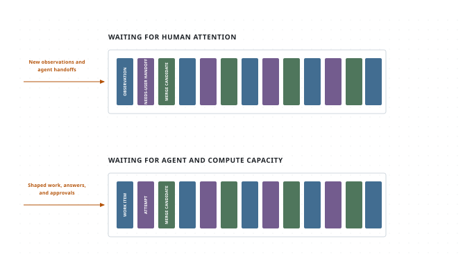
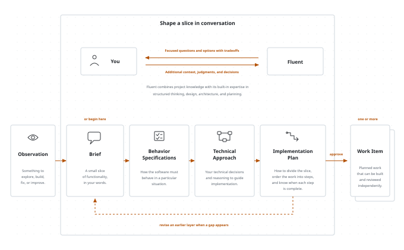
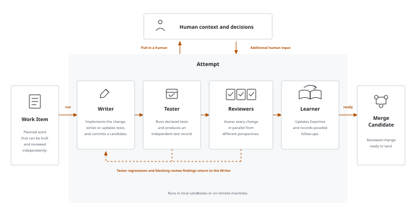

# How I built a self-improving software factory

*[Fluent](https://github.com/mrinalwadhwa/fluent) is an open-source factory that autonomously turns your team's vision, ideas, bug reports, user feedback, production logs, and agent traces into working software.*

At some point in the past few months, I crossed a threshold with coding agents. If I clearly defined a task, specified how a new feature needed to behave, and identified upfront the tests that would verify that behavior, the resulting code usually worked the way I wanted and passed those tests.

If I also gave the agent a clear, written set of coding conventions, the implementation was often close to what I would have written myself. When it needed clarification or started going off course, a short answer or correction was usually enough to bring it back, especially if it was tracking its progress in a file. At first, I still inspected every line. After seeing this happen repeatedly, I stopped feeling the need to.

At the same time, I found myself operating in two modes: waiting for agents to finish, or leaving agents waiting until I came back online or worked through a difficult question. That mismatch in cadence makes the bigger problem clear: How do we organize teams of people and agents working independently on different timelines?

The idea of organizing software delivery as an autonomous factory is not new, but this is the first time we have all the pieces needed to build one.

Once software can be delivered this way, the factory itself becomes the product. Between two teams competing in the same market, the one that can deliver complex features sooner, build more secure software, and fix problems faster wins.

In May, I started building Fluent, a self-improving software factory. I now use it to build Fluent itself and two other complex projects.

You use the factory through the Fluent skill in Codex, Claude Code, Pi, or another coding agent that supports skills. The skill lets you operate the factory through conversation and handles Fluent’s command-line machinery for you.

Install the skill with:

```shell
npx skills add mrinalwadhwa/fluent --skill fluent
```

Then start your coding agent in a project folder and ask it to use Fluent. The first invocation sets up Fluent for that project and starts shaping the work with you.



## How Fluent works

Fluent separates work that needs human attention from work agents can do on their own. You can think of it as two conceptual queues. The first queue waits for people with the right context, judgment, expertise, or authority. The second waits on both agent and compute capacity: room to run an agent within subscription, rate, and budget limits, and a suitable environment with the models, tools, and hardware the work needs.



Whenever you encounter something to explore, build, fix, or improve, ask Fluent to record it as an Observation. Add whatever context you have in the moment; you do not need to know the solution or have worked out every detail. Agents and connected systems can record Observations too. You can return to any Observation later and refine it on your own timeline, bringing in someone with the right expertise or authority when needed.

When you want to act on an Observation, ask Fluent to start shaping it. Once shaping produces a Work Item, ask Fluent to run it directly or add it to the queue. A queued Work Item waits until suitable agent and compute capacity is available. If its Attempt needs human context or a decision, Fluent places the question in the human queue for you or someone with the right expertise or authority to answer. The Attempt waits for that answer while other ready Work Items can continue.

## How you tell Fluent what to build

Ask Fluent to help shape what you want to build as a small slice of functionality. You can start from an Observation you recorded earlier or begin directly with a Brief. Fluent is designed to help you turn that slice into working software without first specifying the entire system. It reads the relevant project code along with the reusable conventions, constraints, and lessons captured as project Expertise.

You do not need to arrive with a finished specification. Fluent collaborates with you as the slice takes shape.

It grounds the conversation in the code and project Expertise, checks that it understands what you mean, and asks one focused question at a time. It uses structured methods for problem framing, behavior design, architecture, and planning to challenge assumptions, find missing cases, research technical choices, and present options with their tradeoffs. You provide context and judgment and make each decision.

The conversation produces four layers of shared context:



**Brief.** A Brief describes one small slice of functionality. It captures, in your words, what you want and why, grounded in the relevant project context. It keeps constraints, assumptions, and unknowns explicit without choosing a solution.

**Behavior Specifications.** A Behavior Specification precisely describes how the software must behave in a particular situation. It is written so the specified observable behavior can be verified without prescribing its implementation.

For the slice described in the Brief, Fluent reads the project’s existing Behavior Specifications and relevant code to understand what the software already guarantees. It then works with you to define the additions, changes, or removals needed for that slice. The result is a behavior diff, not a restatement of the entire system. If the project has no existing Behavior Specifications, the first slice starts them.

Fluent first makes the important terms precise and identifies the people, systems, events, and states affected by the slice. It proposes the core behaviors, then works through gaps, edge cases, and any behavior inferred from the Brief that needs your approval. Decisions about libraries, protocols, storage, and other implementation choices wait for the Technical Approach conversation.

Fluent writes each Behavior Specification in a consistent form that names the situation and the required response. For example:

```text
WHEN a user selects Save on a draft,
THE SYSTEM SHALL show a `Saved` status beside the draft title.
Test: tests/drafts.spec.ts (shows_saved_status_after_save)
```

It describes something a person can observe and a test can verify, without choosing a UI framework, component structure, or persistence mechanism.

Fluent writes Behavior Specifications in EARS, the Easy Approach to Requirements Syntax. EARS uses a small set of patterns that make the triggering event or condition and the required response explicit.

Every new behavior includes either a `Test:` reference or an `Untestable:` reason. While defining the behavior, Fluent inspects nearby tests and names the intended test in the project’s existing style. The referenced test may not exist yet. The Writer creates or updates it during implementation, and the Tester runs it.

When the test passes, the Behavior Reviewer uses that as evidence that the behavior was delivered.

**Technical Approach.** The Technical Approach document captures your technical expertise and judgment before the work is delegated to agents. You and Fluent decide the key technical choices that should guide implementation, including structure, interfaces, protocols, libraries, storage, and integrations. The document gives the Writer both the decisions and the reasoning behind them, while leaving implementation details that agents can safely determine during the work.

**Implementation Plan.** The Implementation Plan turns the confirmed behaviors and technical decisions into work that agents can carry out. You and Fluent decide whether the slice should become one Work Item or several independently reviewable Work Items that can run in parallel.

When steps help the Writer, the Implementation Plan divides a Work Item into steps that state what will become observably true, which behaviors each step delivers, and how the result will be verified. Fluent orders those steps by what must be built first. A small mechanical Work Item can use a minimal plan without inventing steps. When Work Items depend on one another, the plan pins the interfaces they share and the points at which their work must come together.

You confirm each layer before Fluent uses it as the foundation for the next. The conversation can also move backward. If the Technical Approach reveals missing behavior, you return to the Behavior Specifications. If the Implementation Plan exposes an unresolved technical decision, you return to the Technical Approach rather than leaving the Writer to guess.

When you confirm the Implementation Plan, Fluent creates one Work Item for each independently reviewable part of the slice. Each Work Item carries the approved Brief, Behavior Specifications, Technical Approach, and its part of the Implementation Plan. Creating it records the handoff. You can run the Work Item immediately or add it to the queue.

Each time Fluent runs a Work Item, it creates an Attempt, a record of that Work Item’s execution through the Writer, Tester, Reviewers, and Learner. The Attempt tracks revisions, test runs, review findings, and pauses. The Writer keeps a checklist of plan steps, review follow-ups, and evidence as it works. Separate Work Items can proceed independently.

## How Fluent builds it



Fluent gives each Attempt an isolated Git worktree, keeping its changes separate from your working copy. It can run the Writer, Tester, Reviewer, and Learner tasks in a local sandbox or delegate them to a remote machine, currently through AWS Fargate. If the Attempt needs human context or a decision, Fluent returns the question to the human queue.

Within the Attempt, the Writer receives the approved Brief, Behavior Specifications, Technical Approach, and its assigned part of the Implementation Plan, along with the relevant code, project Expertise, and instructions. It implements the change, writes or updates its tests, and commits its changes for the Tester and Reviewers.

Fluent does not rely on the Writer’s own test report, and it does not make every Reviewer rerun the same test suite. Instead, a separate Tester produces one independent test record that all Reviewers share.

The Tester is a deterministic runner, not a coding agent. It runs the project’s declared test commands in the candidate workspace and records the outcome of the suite and its individual tests. The Behavior Reviewer can match this evidence against the Test: references in the Behavior Specifications, while any Reviewer can still run a targeted check to answer a specific question.

Once the Tester completes, Fluent runs independent Reviewers in parallel. Every Reviewer reads the approved planning documents, the Writer’s progress checklist, the proposed changes, the Tester evidence, and recorded decisions.

The checklist tracks any Implementation Plan steps and review follow-ups across rounds, recording completion evidence, divergences, and notes for what comes next. Each Reviewer also loads relevant general and project Expertise, so its judgment reflects both Fluent’s review methods and what the project has learned. The built-in Reviewers include:

The Behavior Reviewer checks that the Behavior Specifications are clear and consistent, and that the candidate delivers each behavior with passing test evidence.

The Architecture Reviewer checks that the change fits the codebase, follows the Technical Approach, and preserves clear, maintainable boundaries and dependencies.

The Tests Reviewer checks that the tests cover the required behavior, boundaries, and failures at the right level, with enough confidence to ship and refactor safely.

The Documentation Reviewer checks that the change is explained accurately at every level its readers need, using clear structure and consistent vocabulary.

More specialist Reviewers can be added for concerns such as security, performance, or deployment safety.

Each Reviewer writes a report that records its evidence, classifies each finding as blocking or minor, and returns `pass`, `fail`, or `uncertain`. `pass` means no blocking findings remain. `fail` means the Writer must address at least one blocking finding. `uncertain` means the Reviewer cannot confidently decide from the approved context and returns the question to the human queue.

After a `fail`, Fluent starts another round. The Writer receives the failed review reports and any Tester regressions, revises the candidate, and commits the revision. The Tester reruns all declared test commands, then the affected Reviewers inspect the revision and mark earlier findings as addressed or still open. If the Attempt reaches its configured review-round limit, Fluent pauses with the evidence collected rather than continuing indefinitely.

Once the Tester and every Reviewer pass, the Learner captures reusable lessons and possible follow-up work before the Attempt produces a ready Merge Candidate.

A ready Merge Candidate contains the reviewed change and any Expertise captured by the Learner, but it has not changed the target branch. Ask Fluent to show you the candidate so you can inspect it and decide whether to land it. By default, Fluent waits for your decision. Projects that want automatic landing can opt into a separate auto-merge process.

Before landing, Fluent brings the candidate up to date with the target branch. It uses an agent to resolve merge conflicts, then runs the project’s pre-merge checks. When a check fails, Fluent can run a project-provided repair step and check again. It updates the target branch only after the checks pass. Conflicts or failures it cannot resolve return to you.

## How Fluent keeps improving your code

While working on a Work Item, Fluent can identify related problems and possible improvements beyond the Brief it was asked to deliver. Problems with the current change, such as Tester regressions and blocking review findings, return to the Writer inside the current Attempt. The Learner records the additional improvements as follow-ups in its handoff. After the candidate lands, Fluent turns each follow-up into an Observation that you can shape and run later.

You can return to one of these Observations later and shape it through the usual conversation. If the Learner captured a complete, testable correction grounded in a current Behavior Specification, project instruction, or project Expertise, Fluent can turn the Observation into a corrective Work Item without repeating the full shaping process. If the correction is incomplete or still requires a decision, the Observation waits for you to shape it.

When Fluent creates one of these corrective Work Items, it waits for your approval by default. A project can instead allow Fluent to authorize and queue complete corrections automatically. Once queued, the Work Item runs when the required agent and compute capacity are available. It goes through the same Writer, Tester, Reviewer, and Learner loop, and its Merge Candidate follows the same inspection and landing policy as any other.

Fluent can also inspect code after it lands. An optional post-merge review runs the Tester and every Reviewer against the cumulative change on the target branch. If a Reviewer fails or is uncertain, Fluent creates and runs a corrective Work Item from the findings. Any Merge Candidate it produces follows the same inspection and landing policy as any other.

## How Fluent learns your project

Each completed change can teach Fluent something about the project: a convention to follow, an architectural constraint to preserve, a testing pattern to reuse, or a gotcha to avoid. The Learner records reusable lessons as Expertise under `.fluent/expertise/`. Fluent draws on that Expertise when it shapes, builds, and reviews future work.

After the Tester and every Reviewer pass, the Learner examines the accepted change, existing Expertise, and the Tester and Reviewer evidence from every round. The Learner updates Expertise when the Attempt reveals project-specific knowledge that future agents should reuse. If the Attempt taught Fluent nothing worth carrying forward, Expertise remains unchanged.

Any Expertise the Learner adds becomes part of the Merge Candidate and lands with the change that produced it. Over time, lessons from many Work Items accumulate in project Expertise, where future shaping conversations, Writers, and Reviewers can build on them. You can inspect and edit Expertise directly when a convention changes or a recorded lesson no longer applies.

Fluent learns from both the change and the process of producing it, then applies those lessons to future work.

## Evaluating the factory

A self-improving software factory is [only as good as its evaluation infrastructure](/articles/how-to-make-agents-that-succeed/). Passing the tests for the current Work Item provides evidence that the requested behavior works, but does not show whether repeated changes are making the codebase harder to maintain and extend.

A factory can keep shipping changes that pass every check while duplication, coupling, and structural complexity accumulate, eventually turning future work into an automated game of whack-a-mole.

Behavior Specifications, independent tests, specialist reviews, and production observations give Fluent several ways to evaluate each change. But evaluating a sequence of changes is harder.

The next area I am exploring in Fluent is cross-change evaluation: looking across Work Items to detect when a change makes later work harder, when tests lose signal, or when local fixes erode the larger design. The goal is to establish not only that each change works, but that repeated changes leave the software safer to extend.

Fluent is open source. If you are thinking about software factories or building one inside your company, explore [Fluent on GitHub](https://github.com/mrinalwadhwa/fluent). You can use it as the foundation for your own factory, reuse parts of its workflow, or take ideas from its design. The project is still early. If you want to compare notes or help build it with me, [join me on Discord](https://discord.gg/dygEVzG3gf).
